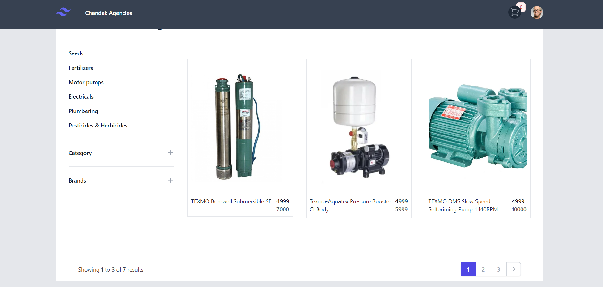
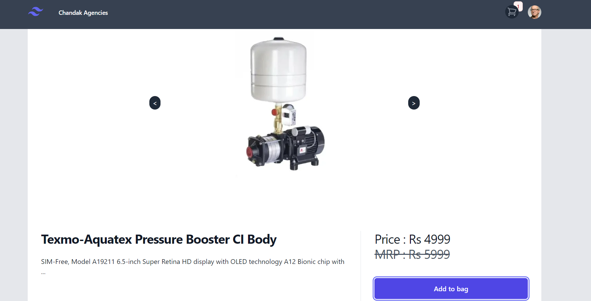
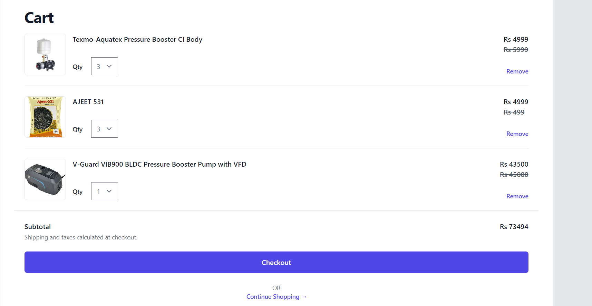
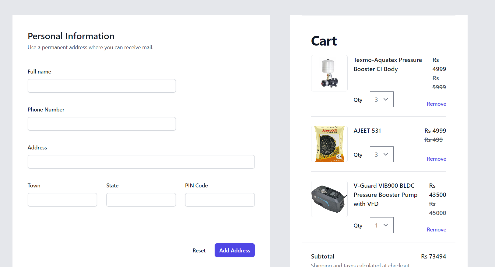
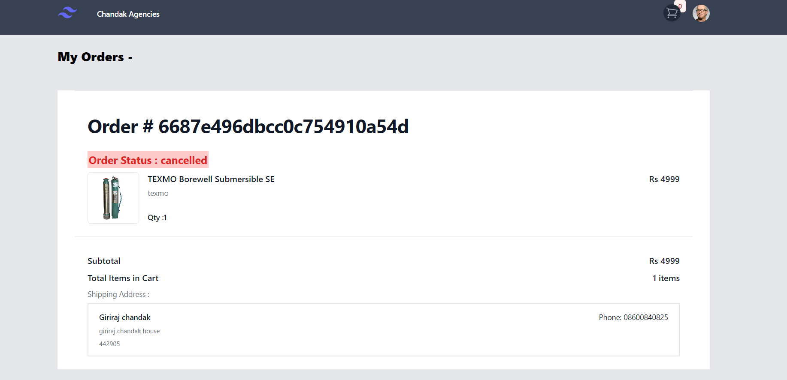

# Chandak Ecommerce Project - (FRONTEND)

Welcome to the Chandak Ecommerce Project! This Project aims at building a platform for chandak agencies to sell their goods to the customers.

## Features

- Product catalog browsing
- Shopping cart functionality
- Checkout functionality with payment integration
- Interactive UI for the user
- Responsive design for mobile devices

## Admin Features

- Creating or Editing products from frontend
- Managing orders and updating the status of order 

## Technologies Used

- Frontend: ReactJS, ReduxToolkit, tailwindCSS , tailwindCSS components 
- Backend: Node.js, Express.js
- Database: MongoDB
- Authentication: JSON Web Tokens (JWT)
- Payment Integration: Stripe

## Some of the glimses of the frontend 

### Home Page

### Product Details Page

### Cart Page

### Checkout Page

### User orders Page
